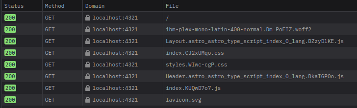
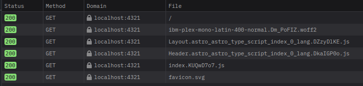
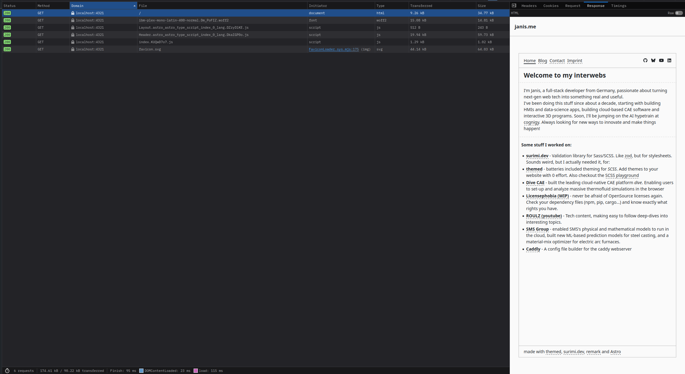

When I started building this website with [astro](https://astro.build), I quickly searched for ways to optimize it. What I wanted was static HTML with as little network requests as reasonably possible.
(Btw, I chose astro mainly for templating and it's [content collections](https://docs.astro.build/de/guides/content-collections/), which allow to easily build blogs.)

Now, the network requests initially looked something like this:


The index (`/`) route loads
- a font (I marked it as `preload` to prevent content-shifts)
- a script that handles theming (it sets the `data-theme` attribute on the `<html>` element based on user preferences)
- the main, global stylesheet
- styles specific to font-awesome (I plan on getting rid of them. Pretty useless for me)
- another script for theming, this time the theme toggle buttons in the header
- finally, a favicon.

I wanted to optimize this somewhat, specifically reduce the network requests. Bundling the styles into the main HTML should be pretty easy. Astro has a built-in option for that: `inlineStylesheets`.
```typescript
export default defineConfig({
  build: {
    inlineStylesheets: 'always',
  },
});
```

The `always` option means that all styles will be inlined into `<style>` tags. This reduces the number of network requests:


The coolest thing about this is, that the very first request is already styled. This does reduce layout shifts entirely:


Now, what's the catch?

Notice how the theme buttons at the top right are missing, and how the theme is in the `light` mode? This is because both need some javascript to work, which can only run on the client
(Technically, I could pre-render them with astro, and I could even run astro in server mode to send the theme preference to the server first... but as I said, I want static HTML).
Although these buttons and the theme logic will be loaded later, the browser considers the HTML/DOM to be loaded from request one! And this is an issue!

The browser will only halt the initial page render, when it encounters things like inline scripts (that are not async or deferred) in the `<head>` element.
Because there are none of these `style` or `script` tags in the `<head>`, the browser considers the HTML to be fully loaded, and will not wait for anything before rendering the page.
Then, when the script and style is evaluated, the browser will suddenly update the page with the new theme and potentially new styles, which can cause visual 'flashes' and even layout shifts.

This is particularly visible if the user prefers a dark theme. The page will be rendered in light mode first, and then suddenly switch over.

The easiest way to prevent this, would be to tell browsers to wait for the loaded script. And while there is a [`blocking`](https://developer.mozilla.org/en-US/docs/Web/API/HTMLScriptElement/blocking) attribute for scripts, it is not supported by all browsers.
Instead, we can make the browser load the style and scripts in the `head`, and only consider the render done when they are loaded.

To ensure the script is inlined into the HTML, I ended up using a [neat little repo](https://github.com/brandonaaron/astro-script-embed#readme) that allows to inline/embed scripts while still being able to load things from `node_modules`. Check it out!

I am sure astro also has some way to inline scripts from a `layout` component into the first request, but I haven't figured that out yet. That would ensure the theme-related script is also run before the first render.
If you know how to do that, please let me know via [bluesky](https://bsky.app/profile/janis.me).